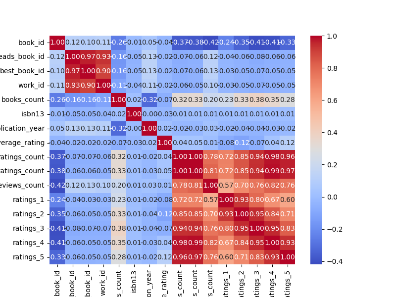
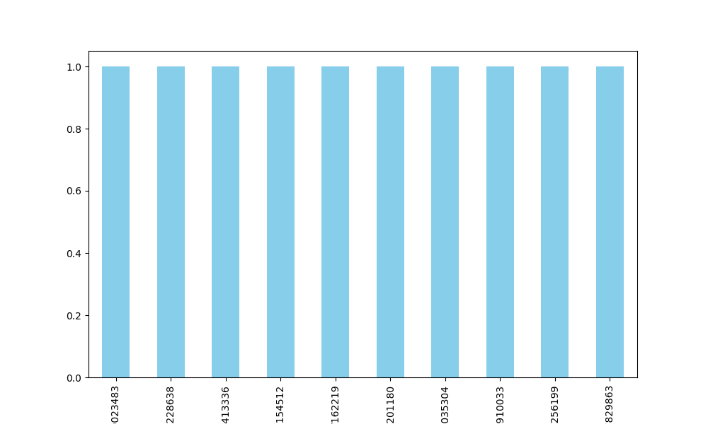

# Analysis Report

### Summary of the Goodreads Dataset

The dataset consists of **10,000 entries** with **23 columns**, capturing various attributes related to books listed on Goodreads. Key attributes include book identifiers, author names, publication years, language codes, ratings, and review counts.

#### Key Insights

1. **Missing Values**:
   - Significant missing values are found in `isbn` (700 missing), `isbn13` (585 missing), `original_publication_year` (21 missing), `original_title` (585 missing), and `language_code` (1084 missing).
   - The `isbn` and `isbn13` fields are crucial for identifying books uniquely, and their missing values could impact data integrity.

2. **Authors**:
   - There are **4,664 unique authors**, with **Stephen King** being the most frequently mentioned (60 times). This indicates a diverse range of authors represented in the dataset.

3. **Publication Years**:
   - The dataset includes books published as early as **-1750** (likely a data entry error) to the year **2017**. The average publication year is around **1982**.
   - A small number of entries have missing publication years, which could affect analyses focused on trends over time.

4. **Ratings**:
   - The average rating across all books is **4.00** (out of 5), suggesting that the books in this dataset are generally well-received.
   - The distribution of ratings (1 to 5) shows that higher ratings (4 and 5 stars) are predominant, indicating a bias towards popular or quality literature.

5. **Language Representation**:
   - The most common language code is **"eng"** (English), representing **6,341** entries. However, there are **25 unique languages** present, indicating some diversity in language representation.

6. **Visual Insights**:
   - A histogram of average ratings will likely show a right-skewed distribution, indicating that most books receive higher ratings.
   - A bar chart of the top authors based on their books’ ratings or counts could highlight the most impactful writers in this dataset.

#### Recommendations

1. **Data Cleaning**:
   - Address the missing values, especially for `isbn`, `isbn13`, `original_title`, and `language_code`. Consider imputation strategies or removing records with excessive missing data.
   - Investigate the extreme values in `original_publication_year` to ensure they are valid or correct any potential data entry errors.

2. **Further Analysis**:
   - Conduct an analysis of rating distributions to identify any patterns in reader preferences.
   - Explore trends in publication years to see if there is a correlation between the publication date and average ratings.

3. **Author Focus**:
   - Given the popularity of certain authors, consider creating a focused analysis or recommendations based on the authors with the highest ratings or most books.

4. **Language Diversity**:
   - Explore the representation of non-English books further, as they may cater to a different audience that could be overlooked in English-centric analyses.

5. **Visualization**:
   - Create visualizations such as box plots for ratings per year or bar charts for the number of books per author to provide a more intuitive understanding of the dataset.

By implementing these recommendations, the dataset can be leveraged more effectively to draw insights and inform decisions, whether for publishing, marketing, or academic purposes.

