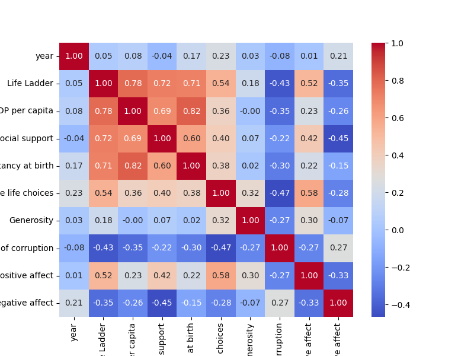
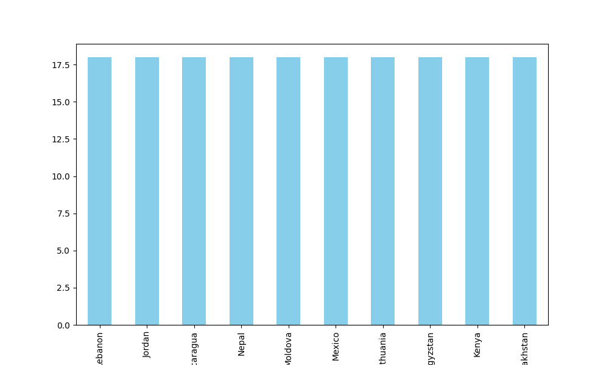

# Analysis Report

### Summary of the Happiness Dataset

The dataset, `happiness.csv`, consists of 2,363 entries across 11 columns, capturing various metrics related to happiness and well-being across different countries and years. The key columns include life satisfaction scores (Life Ladder), economic indicators (Log GDP per capita), and social metrics (Social Support, Freedom to make life choices, etc.).

#### Key Insights

1. **Missing Values**: 
   - The dataset contains several missing values, notably in the columns of Generosity (81 missing), Perceptions of corruption (125 missing), and Healthy life expectancy at birth (63 missing). Addressing these missing values is crucial for accurate analysis.

2. **Overall Happiness (Life Ladder)**:
   - The average Life Ladder score is approximately 5.48, with a range from 1.281 to 8.019. This suggests a diversity in life satisfaction levels across countries.

3. **Economic Factors**:
   - The mean Log GDP per capita is around 9.40, indicative of economic disparities. There are 28 missing values in this column, which should be addressed for a more complete economic analysis.
   - A potential correlation between GDP and happiness can be further explored by visualizing scatter plots between Life Ladder and Log GDP per capita.

4. **Social Support**:
   - The average Social Support score is 0.81, indicating a generally supportive social environment, which is crucial for overall happiness. 

5. **Healthy Life Expectancy**:
   - The mean Healthy life expectancy at birth is approximately 63.4 years, with significant variation (min: 6.72, max: 74.6). This suggests that health outcomes can influence happiness levels significantly.

6. **Perceptions of Corruption**:
   - The average score for Perceptions of corruption is 0.74, where lower values indicate higher perceived corruption. This metric could be further explored to understand its impact on happiness.

7. **Positive and Negative Affect**:
   - The balance between Positive affect (mean: 0.65) and Negative affect (mean: 0.27) indicates a general tendency towards positivity in emotional well-being across the dataset.

#### Recommendations

1. **Address Missing Values**: 
   - Implement appropriate imputation methods or data cleansing techniques to handle missing values, especially in critical columns like Generosity and Perceptions of corruption.

2. **Visual Analysis**: 
   - Conduct visualizations such as scatter plots, heat maps, and box plots to explore relationships between variables (e.g., Life Ladder vs. Log GDP per capita, Social Support vs. Life Ladder).

3. **Correlation Analysis**:
   - Perform correlation analysis to understand the relationships between happiness metrics and other variables like GDP, social support, and perceptions of corruption.

4. **Country-Specific Insights**:
   - Investigate country-specific trends and outliers to capture unique patterns or insights that can inform targeted policy recommendations for improving happiness and well-being.

5. **Longitudinal Study**:
   - Consider a longitudinal analysis by examining changes over the years to identify trends and the impact of economic or social policy changes on happiness.

By exploring these recommendations and insights, policymakers and researchers can gain a better understanding of the factors influencing happiness and well-being across different populations, leading to more effective strategies for improvement.

