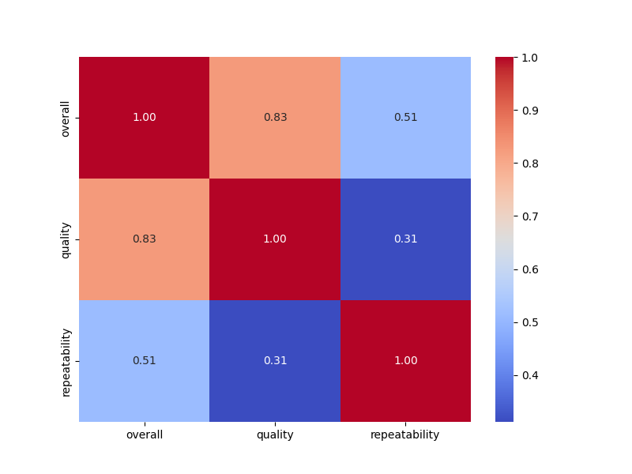
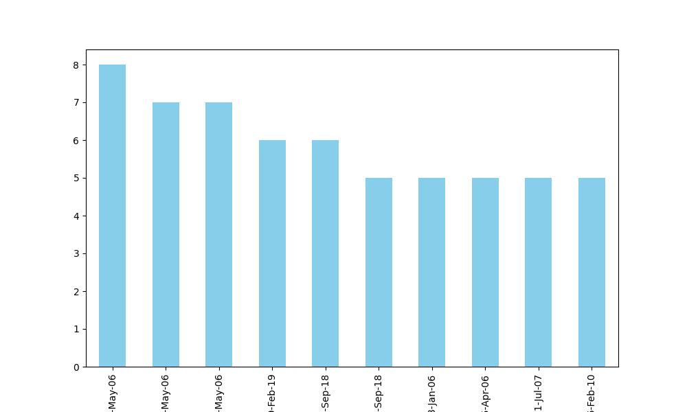

# Analysis Report

### Summary of the Dataset

The dataset `media.csv` consists of **2,652 entries** and **8 columns**. The columns include information about the date of the media, its language, type (e.g., movie, series), title, creator (by), and ratings, including overall rating, quality, and repeatability. The dataset has a notable number of missing values, particularly in the 'by' column, where **262 entries** lack information about the creator.

### Key Insights

1. **Missing Values**: 
   - The 'date' column has **99 missing entries**, and the 'by' column has **262 missing entries**. This could impact analyses involving temporal trends and creator contributions. Filling or imputing these missing values is recommended.

2. **Language Distribution**:
   - The dataset contains **11 unique languages**, with **English** being the most prevalent, appearing in **1,306 entries**. This suggests a potential focus on English media, which may reflect audience preferences or data collection bias.

3. **Media Type**:
   - The most common media type is **movie**, which accounts for **2,211 entries**. This indicates a significant emphasis on films compared to other media types.

4. **Title Variety**:
   - There are **2,312 unique titles**, indicating a diverse range of media content. However, the title 'Kanda Naal Mudhal' appears most frequently, with **9 occurrences**.

5. **Rating Analysis**:
   - The **overall rating** has a mean of **3.05** (out of 5), with a standard deviation of **0.76**, suggesting a moderate level of satisfaction among viewers.
   - The **quality rating** has a slightly higher mean of **3.21** (out of 5), indicating that viewers might perceive the quality of media slightly better than the overall experience.
   - **Repeatability** ratings are lower, with a mean of **1.49**, suggesting that most media are not frequently rewatched or revisited, with a tendency towards lower scores (1-2).

### Recommendations

1. **Address Missing Values**:
   - Consider imputation techniques for the missing values in the 'date' and 'by' columns. For example, date imputation could be done using the mode or median, while creator information could be inferred from similar entries if applicable.

2. **Explore Viewer Preferences**:
   - Conduct further analysis on viewer preferences by segmenting the data by language and media type. This could help in understanding which types of media are more popular among different language speakers.

3. **Quality Improvement**:
   - Given that the overall rating is moderate, consider conducting surveys or collecting feedback to identify elements that can improve viewer satisfaction. This could be particularly useful for media with lower repeatability scores.

4. **Targeted Content Creation**:
   - Since English media dominates the dataset, consider expanding the collection of media in other languages to diversify offerings and cater to a broader audience.

5. **Trend Analysis**:
   - Analyze the time series data in the 'date' column to identify trends over time in media consumption, which could inform future content strategies and marketing efforts.

6. **Visualizations**:
   - Utilize bar charts to visualize the distribution of media types and languages and box plots to illustrate the distribution of ratings. This can help stakeholders understand the dataset's characteristics at a glance.

By addressing these insights and recommendations, stakeholders can enhance the quality and relevance of the media content, ultimately improving viewer engagement and satisfaction.

